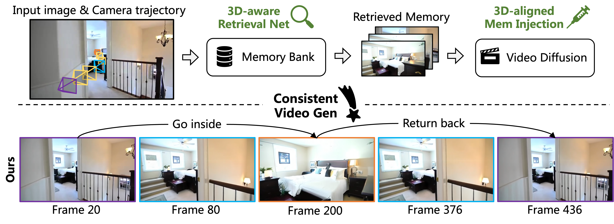

## I3DM: Implicit 3D-aware Memory Retrieval and Injection for Consistent Video Scene Generation

### [Paper](https://arxiv.org/abs/2603.23413) | [Project page](https://riga2.github.io/i3dm/)



### Installation
``` sh
git clone https://github.com/Riga2/I3DM.git
cd I3DM

conda create -n i3dm python=3.10 -y
conda activate i3dm

pip install torch==2.4.1 torchvision==0.19.1 torchaudio==2.4.1 --index-url https://download.pytorch.org/whl/cu124
pip install -e .
```

### Models
``` sh
# download the base model
mkdir your_base_model_dir
hf download alibaba-pai/Wan2.1-Fun-V1.1-1.3B-Control-Camera --local-dir=your_base_model_dir

# TODO: Replace your_base_model_dir in configs/model_conf_wan_fun_i2v_1.3b.json

# download the finetuned models
mkdir ./trained_models
hf download Riga27527/I3DM --local-dir=./trained_models
```

### Download Re10K test data
``` sh
mkdir -p YOUR_RAW_DATAPATH
mkdir -p YOUR_PROCESSED_DATAPATH

hf download yiren-lu/re10k_pixelsplat \
  --repo-type dataset \
  --include "test/*" \
  --local-dir YOUR_RAW_DATAPATH

python process_data.py --base_path YOUR_RAW_DATAPATH --output_dir YOUR_PROCESSED_DATAPATH --mode 'test'
```

### Inference on Re10K (200 samples)
``` sh
# eval using 4 GPUs (RTX 4090 is okay)
# replace YOUR_PROCESSED_DATAPATH with the dir you created above
accelerate launch --num_processes=4 scripts/eval_re10k.py \
  --metadata-path YOUR_PROCESSED_DATAPATH/test/re10k_test_list.txt \
  --caption-path configs/re10k_test_captions.json \
  --checkpoint-path ./trained_models/step-11000.safetensors \
  --retrieval-ckpt-path ./trained_models/ckpt_0000000000016000.pt
```

### Training
Step 1: Download and process re10K training data.
``` sh
hf download yiren-lu/re10k_pixelsplat \
  --repo-type dataset \
  --include "train/*" \
  --local-dir YOUR_RAW_DATAPATH

python process_data.py --base_path YOUR_RAW_DATAPATH --output_dir YOUR_PROCESSED_DATAPATH --mode 'train'
```

Step 2: (Optional) Train Retrieval Net using LVSM, or you can directly use our trained model (trained_models/ckpt_0000000000016000.pt).
``` sh
# Step 2.1: Generate the Wandb key file and save it in ./LVSM/configs/api_keys.yaml.

# Step 2.2: Download the base LVSM model
mkdir -p ./LVSM/checkpoints
wget -O ./LVSM/checkpoints/scene_decoder_only_256.pt \
  "https://huggingface.co/coast01/LVSM/resolve/main/scene_decoder_only_256.pt?download=true"

# Step 2.3: Run the training of Retrieval Net
sh ./LVSM/train.sh training.dataset_path=YOUR_PROCESSED_DATAPATH/train/full_list.txt
```

Step 3: Filter out the scene less than 77 frames in Re10K training dataset, and divide them into multiple video clips by running the below script.
``` sh
python scripts/re10K_clips_process.py --base_dataset_dir YOUR_PROCESSED_DATAPATH
```
Then caption each video clip using Qwen2.5-VL. You can refer to [Qwen2.5-VL-Video-Captioning](https://github.com/cseti007/Qwen2.5-VL-Video-Captioning.git) for a good start. A tiny example:
``` json
{
    "0000cc6d8b108390_clip0": "The living room has warm lighting and wooden flooring, with black curtains framing large windows on one side. A stone fireplace with \"HOPE\" signage above it stands near modern furniture, including a dark sofa with patterned cushions and a white coffee table in front of an entertainment center housing a flat-screen TV. Light-colored walls enhance the simple yet stylish decor.",
    "0000cc6d8b108390_clip1": "Modern furnishings include dark leather couches with patterned throw pillows, complementing a sleek stone fireplace that serves as an elegant focal point on light-colored walls. A flat-screen TV is mounted near large windows draped with black curtains, allowing natural light while maintaining privacy. Warmth is provided by recessed lighting and warm-toned hardwood flooring.",
    "0000cc6d8b108390_clip2": "The living room boasts warm tones with beige walls and dark wooden flooring that contrasts elegantly against the stone fireplace adorned with \"HOPE\" letters on the mantel. A flat-screen TV hangs above an entertainment stand next to a small white coffee table holding candles in teal holders. Black curtains frame large windows, letting in natural light while adding depth. A sleek floor lamp casts soft lighting, enhancing the cozy, stylish interior perfect for relaxation and entertainment.",
    "00028da87cc5a4c4_clip0": "An elegant kitchen with white cabinetry and classic paneling blends seamlessly with wooden countertops and light wood flooring. Warm ceiling lights illuminate the space, featuring modern appliances like a microwave in upper cabinets above a central island. Soft pastel dining areas through open archways enhance a cohesive, traditional aesthetic.",
    "00028da87cc5a4c4_clip1": "White cabinetry with raised panel doors contrasts with light walls in an open-plan layout featuring hardwood flooring. A central island offers extra counter space, enhanced by pendant lighting. The design is clean and modern with traditional elements reflected in the cabinet styles and warm tones."
}
```

Step 4: Finetune the diffusion model.
``` sh
# Replace YOUR_PROCESSED_DATAPATH with the processed training data directory
sh scripts/train.sh \
  --dataset_metadata_path YOUR_PROCESSED_DATAPATH/train/full_list_F77_clips.txt \
  --dataset_caption_path YOUR_PROCESSED_DATAPATH/train/caption_F77/video_captions_refined.json
```

### Citation
If you find this repository useful in your project, please cite the following work. :)
```
@article{li2026i3dm,
  title={I3DM: Implicit 3D-aware Memory Retrieval and Injection for Consistent Video Scene Generation},
  author={Li, Jia and Yan, Han and Chen, Yihang and Li, Siqi and Song, Xibin and Wang, Yifu and Cai, Jianfei and Wong, Tien-Tsin and Ji, Pan},
  journal={arXiv preprint arXiv:2603.23413},
  year={2026}
}
```

### Acknowledgments
We borrow heavily from the following repositories. Many thanks to the authors for sharing their codes.
- [DiffSynth-Studio](https://github.com/modelscope/diffsynth-studio)
- [LVSM](https://github.com/haian-jin/LVSM)
- [WAN-AI](https://github.com/Wan-Video)
- [Qwen2.5-VL-Video-Captioning](https://github.com/cseti007/Qwen2.5-VL-Video-Captioning.git)
